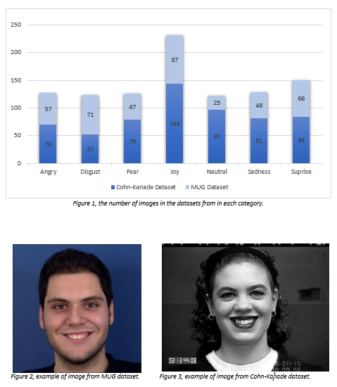
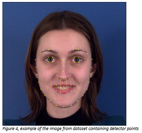
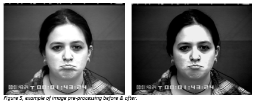
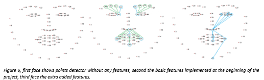

# ai-classification-ML-NET
Emotions recognition application that will be able to distinguish between seven basic facial expressions: joy, surprise, neutral, anger, fear, disgust and sadness. 

[...]
Research showed that use of combination of different datasets seems to be more effective (K.S.Gayathri,  2019). Two different datasets were chosen in this project; Cohn-Kanade and MUG datasets (see example  in figure 2&3), based on the best quality of the images compering to other available datasets for this  project. Datasets together contained number 1009 of images of people with different facial expressions  (see figure 1).

Framework “Dlib” was used in order identify people faces from images and then to produce the detector points. This created a set of points on each picture from the datasets corresponding to the key locations on the face, which allowed to calculate the distances between key landmarks (see figure 4):

·     Left lip & Right lip

·     Width & Height of the lips 

·     Left eyebrow & eye

·     Right eyebrow & eye*.*

To allow the model to recognize and distinguish seven basic facial expressions: joy, surprise, neutral, anger, fear, disgust, and sadness use in this study. The processed and normalized data has been saved in a form of numeric dataset that will be understandable by machine learning program. 

The model uses a supervised algorithm as it was best suited for this project, as knowing what the output values should be allowed to evaluate the behaviour of the algorithm. The application of this type of algorithm allowed to supervise it and evaluate the results to the expected precision of emotions, performance and verify problems or deviations. The whole set is discrete, and each input image was allocated to one of seven types of emotions, this data properties allowed the use of a classification algorithm.

## Data preparation and image pre-processing:
The first step included data preparation and image pre-processing, doing so can have a significant effect on the accuracy of the model (Pintelas, 2006). Research showed that performance of the model can be negatively affected by poor data, which is not representative or noisy (Scikit-Learn & Keras, 2019). All the images that the algorithm was not able to produce correct detector on were edited using contrast enhancement or/and using sharpen tools (see figure 5) and checked again, all images that once again were wrongly detected were removed from the dataset. Data was transformed and catalogize further to create the same amount of images in each group of the emotions. In addition, all images have been reviewed and sorted into the best fitting categories based on the emotions on the face
. 

## Adding more features:
Next, the decision was made to create more features. The standard features had only calculated few main distances between key landmarks on the face, for example the distance between left lip & right lip and its width & height (see figure 6), which are not able to assess whatever or not mouth or eyes are actually open, whilst its distance can have a huge impact when assessing facial expression, such us “surprise” as commonly the eyes of the person in this case are wide open.  Therefore, an additional feature was added to also calculate the distance between top and bottom lip and the inner eye height value. An extra parameter was also added to measure the distance between the edges of the lips, nose, and chin (see figure 6). The aim of adding extra features was to allow the algorithm to learn based on the bigger amount of information and to increase the difference between images that had similar parameters. 

